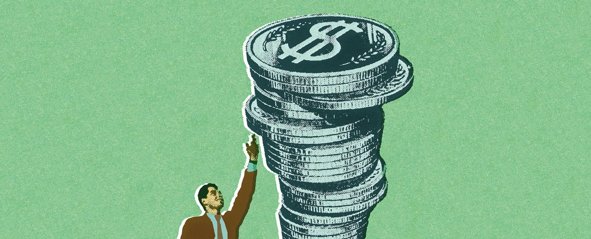

# Future Sales Prediction with Machine Learning
Predicting the future sales of a product helps a business manage the manufacturing and advertising cost of the product. There are many more benefits of predicting the future sales of a product.

## Future Sales Prediction (Case Study)
The [dataset](https://raw.githubusercontent.com/amankharwal/Website-data/master/advertising.csv) given here contains the data about the sales of the product. The dataset is about the advertising cost incurred by the business on various advertising platforms. Below is the description of all the columns in the dataset:

- **TV**: Advertising cost spent in dollars for advertising on TV;
- **Radio**: Advertising cost spent in dollars for advertising on Radio;
- **Newspaper**: Advertising cost spent in dollars for advertising on Newspaper;
- **Sales**: Number of units sold;

## modules to be used: 
- numpy
- pandas
- tkinter
- plotly

---
### who am I ?
> Hi everyone! My name is Osi and I'm 20 years old. I'm a beginner programmer and I'm excited to share my journey with all of you. I'm looking forward to learning and growing my programming skills, and I'm sure that this community will be a great help to me. I'm sure I'm going to have a lot of fun along the way!

